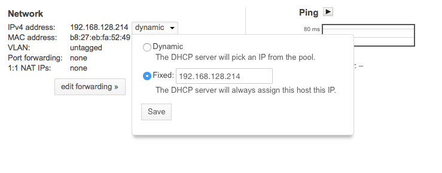

# naspberrypi2
RPi 2 NAS Project


## Shopping List

* [Raspberry Pi](http://www.amazon.com/gp/product/B00TFV5QTA)
* [2 x 3TB USB Drives](http://www.amazon.com/gp/product/B00E3RH63A)
* [1 x 16GB SD Card](http://www.amazon.com/gp/product/B00M55C0LK)

Total price for me on June 26, 2015 was $243.11

## Install OS

I used torent.  Downloaded from: 
http://www.raspberrypi.org/downloads/

Create SD Card to boot from.  Instructions are here: 
https://www.raspberrypi.org/documentation/installation/installing-images/mac.md

```
unzip 2015-05-05-raspbian-wheezy.zip
Archive:  2015-05-05-raspbian-wheezy.zip
  inflating: 2015-05-05-raspbian-wheezy.img
```
This expands a 3.1GB file.  Make sure you have room!  

Now we put an SD card into the Mac.  From there we look at the output of diskutil -l 
and we can see that our SD card is #3.  Yours may be different.  

Copy the image into the SD card with the below commands:

```
diskutil unmountDisk /dev/disk3
sudo dd bs=1m if=2015-05-05-raspbian-wheezy.img of=/dev/disk3
```

This operation takes about 18 min on my machine. 

Put the SD card into the Raspberry Pi, turn it on and do basic config.  Log in remotely.

## Static IP Address

I put a static IP address in my router to get this to stay the same IP address for all my servers. 



## Configure RAID

```
ssh pi@192.168.128.214
sudo apt-get install mdadm 
```
When you get a prompt asking to type something, press 'Ok', then type 'none'
When done, configure devices:

```
mdadm --create /dev/md0 --level=1 --raid-devices=2 /dev/sda1 /dev/sdb1
```
Make sure you see the md0 device: 
```
cat /proc/partitions
```
Note: I didn't reformat /dev/sdb1 nor /dev/sda1 as I just left them based on what they came with. 

## Sources

* http://www.mikronauts.com/raspberry-pi/raspberry-pi-2-nas-experiment-howto/ 
* http://www.mikronauts.com/raspberry-pi/raspberry-pi-2-usb-hard-drive-and-adapter-tests/ 
* https://www.raspberrypi.org/forums/viewtopic.php?t=38429 
* http://www.davidhunt.ie/raid-pi-raspberry-pi-as-a-raid-file-server/
* https://www.raspberrypi.org/forums/viewtopic.php?f=66&t=99447 
* https://www.debian.org/doc/manuals/debian-reference/ch09.en.html#_data_encryption_tips 
* https://thelastmaimou.wordpress.com/2014/04/07/picryption-truecrypt-for-the-pi-2/
* https://raymii.org/s/articles/Build_a_35_dollar_Time_Capsule_-_Raspberry_Pi_Time_Machine.html
* https://www.davidschlachter.com/misc/netatalk3rpi
* https://www.raspberrypi.org/forums/viewtopic.php?f=36&t=84187
* https://kremalicious.com/ubuntu-as-mac-file-server-and-time-machine-volume/ 
